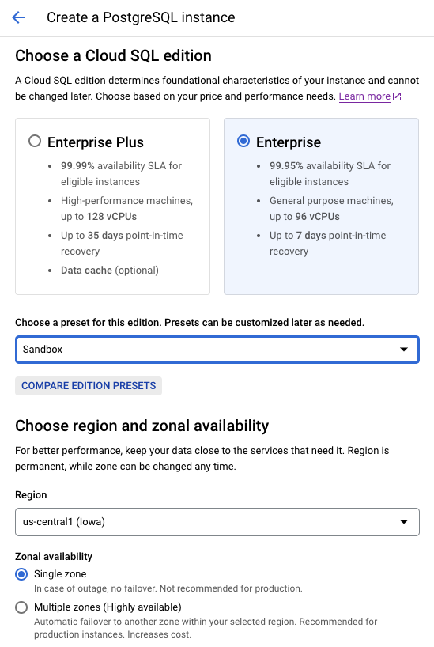
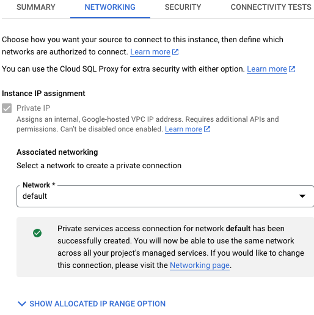
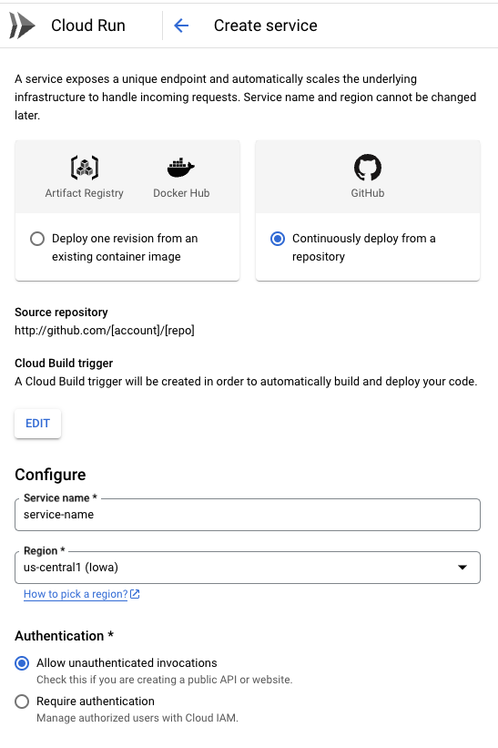

**Deploying a Go Application to Google Cloud**

For businesses, maintaining competitiveness and productivity is paramount. When embarking on application development, efficiency in scaling, cost reduction, rapid innovation, and ensuring reliability and security are top priorities. For Go developers, **Google Cloud Platform (GCP)** offers a comprehensive suite of tools and services tailored for deploying and managing applications efficiently.

In this post, I'll show you how to set up TODOx(a to-do application written in **Go** & **HTMX**) using **Google Cloud Build**, ensuring that changes to the repository of the application are automatically built into container images in **Artifact Registry** and deployed to **Cloud Run**.

**Before proceeding**

Let's address a question you may have: What are the benefits of deploying applications to **Google Cloud Run**?

The following are some of the ones I would highlight:

- **Fully Managed Serverless Platform:** Cloud Run provides a fully managed serverless environment, freeing you from the infrastructure management. This allows you to focus on developing and deploying your applications.

- **Containerized Workloads:** Cloud Run supports containerized workloads, which gives you flexibility and portability in how you build and deploy your applications.

- **Automatic Scaling:** Cloud Run automatically scales your applications based on incoming requests, which can help you save on costs by only paying for resources when they're in use.

- **Pay-per-use Billing:** It means you only pay for the resources your application consumes, billed by the number of requests and the duration of each request.

**Let's move on**

**Step 1: Creating a SQL Instance.**

The first thing we are going to configure is our SQL service.

Go to Cloud SQL Instances. Once there click **Create instance**.

Now, choose the option **PostgreSQL**, which is the database management system we will be using.

To continue with the process it is necessary to enable **Compute Engine API** for our **Google Cloud Project**.

In the page **PostgreSQL instance**, set an instance ID, and a password for the default admin user that is named **postgres**.

Now, choose a database version. We will be using **PostgreSQL 15**.

Next, choose a plan **Cloud SQL Edition** based on your price and performance needs. For this demo, we will be using the **Enterprise** and **Sandbox** combination.

In the section **Choose region and zonal availability**, select the region and zone.

  

Finally, click **Create Instance**.

**Step 2: Creating a database.**

Once the SQL instance creation process is finished, go to **Cloud SQL Instances**, click on the instance created previously, go the section **Databases**, click **Create Database**, set a database name, and click **Create**.

That is all what we need to do here.

**Step 3: Assigning a Private Instance IP.**

In order to connect the source to the SQL instance, we will set a Private Connection.

Go to the section **Networking** of our SQL instance, and select the option **Private IP**.

Next, enable **Networking API**, allocate an IP range, we will be using an automatically allocated IP range.

 

Finally, create a default connection, and click **Save**.

**Step 4: Creating a Secret Variable.**

To securely store API keys, passwords, and other sensitive information, you can use **Secrets**.

Go to **Security**, then go to the section **Secret Manager**, and enable **Secret Manager API**.
Next, click **Create Secret**, set a name, a value, and click **Create Secret** to save the changes.

**Step 5: Creating a Cloud Run Service.**

Before creating the Cloud Run service,

Set the following APIs:
- Cloud Build API.
- Artifact Registry API.
- Container Analysis API.
- Identity and Access Management (IAM) API.
- Serverless VPC Access API.

And add the role **Secret Manager Secret Accessor** to our service account.

Now, let's create the service.

Go to **Cloud Run**, click **Create Service**.

In the page **Create Service**, choose the option **Continuously deploy from a repository.**, and click **Setup with Cloud Build.**.

In the page **Set up with Cloud Build**, choose the Github repository where the TODOx application is hosted, choose the branch on which the deployments will be based, choose the **build type** (we will be using **Docker**), set the source location, and click **Save**.

Once the Cloud Build Setup is done, set a service name, a region, and an authentication type (for this demo, we will be allowing unauthenticated invocations).

In the section **Variable & Secrets**, add a variable **DATABASE_DRIVER**, and a variable **DATABASE_URL** that will refer to the secret we added in one of the previous steps.

In the section **Networking**, select the option **Connect to a VPC for outbound traffic**, this allow the Cloud Run service to send traffic to the Virtual Private Cloud, select the **Serverless VPC Access Connector** that we configured before, and set the service to route all traffic to the VPC.

 

Finally, click **Create**.

Now, we just have to wait a few minutes for the Cloud Run service creation process to finish.

**Conclusion**

Once the service is created, a first deployment is done automatically. The URL of the application will be visible in the page **Cloud Run Service Details**. Keep in mind that every change pushed to the branch **main** will trigger a new deployment, so you probably want to add some restrictions here to manage a bit better when a new version of the application should be deployed.

This is just a small sample of all you could do with Go, and technologies like **Google Cloud**, **Docker**, and **Github**.

Nothing more to add for the moment, thanks for reading!